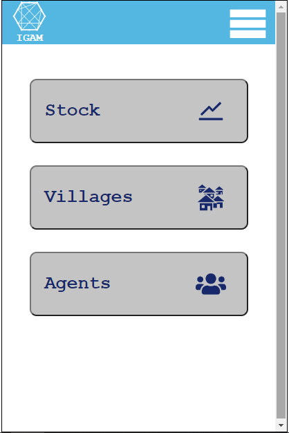

# IGAM

 

  

  <h2 align="center"><a href=''><strong>Check »</strong></a>

<!-- TABLE OF CONTENTS -->

## Table of Contents

- [About the Project](#about-the-project)
- [Getting Started](#getting-started)
- [Built With](#built-with)
- [Contact](#contact)

<!-- ABOUT THE PROJECT -->

## About The Project

<!-- GETTING STARTED -->

## Getting Started

## Built With

## Roadmap

## Contact

